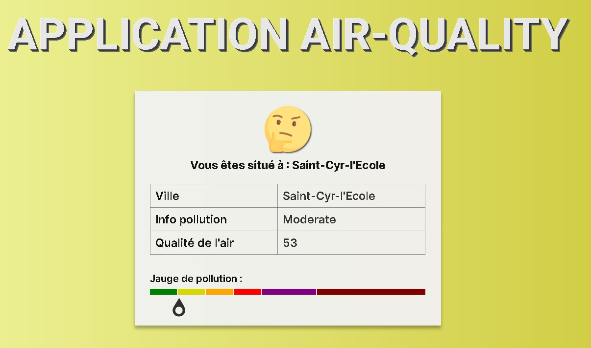

# Application Air-Quality

Cette application permet de consulter la qualité de l'air dans différentes villes.

## Capture d'écran

## Fonctionnalités

- Affichage des informations sur la qualité de l'air

## Installation

[Décrivez ici comment installer et exécuter votre application.](https://juliennedellec.github.io/air-quality/)
